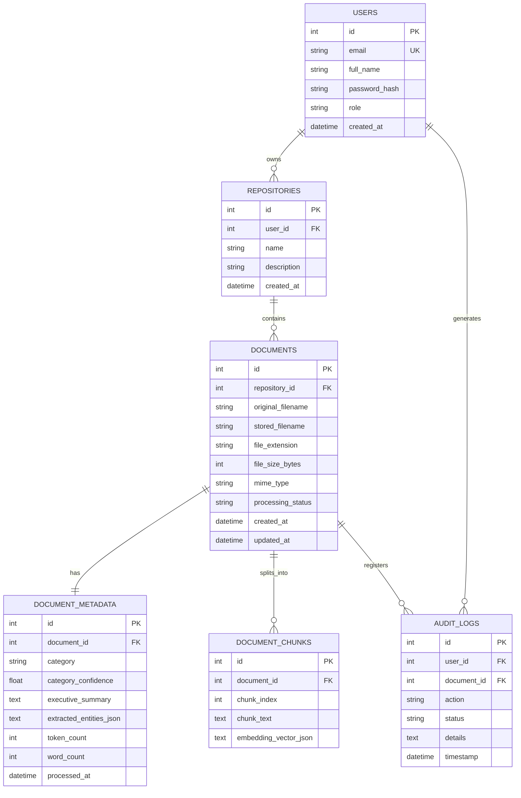

# 02 - DOCUMENTO DE DISEÑO DE SOFTWARE Y ARQUITECTURA
**PROYECTO INTEGRADOR: SISTEMA DE GESTIÓN DOCUMENTAL INTELIGENTE (DocuMind Enterprise)**  
**Asignatura:** Desarrollo de Aplicaciones Empresariales – VI Semestre  
**Institución:** Unidades Tecnológicas de Santander (UTS)  
**Docente:** Wilson Castaño Galviz  

---

## 1. Arquitectura General de la Solución
El sistema **DocuMind Enterprise** implementa una arquitectura desacoplada por capas basada en microservicios modulares y el patrón de diseño **RAG (Retrieval-Augmented Generation)**. La solución garantiza alta cohesión, bajo acoplamiento y escalabilidad horizontal.

```
+---------------------------------------------------------------------------------+
|                                CAPA DE CLIENTE                                  |
|  Single Page Application (SPA) Web Corporativa (HTML5, Modern CSS Tokens, ES6+)  |
|  [Módulo Auth]  [Gestor Carpetas]  [Visor Docs]  [Chatbot RAG]  [Dashboard KPIs]|
+---------------------------------------+-----------------------------------------+
                                        | (HTTPS / JSON REST API)
+---------------------------------------v-----------------------------------------+
|                                CAPA DE SERVICIOS                                |
|                        Backend API REST (Python FastAPI)                        |
|  +---------------------------------------------------------------------------+  |
|  | Routers: /auth  |  /repositories  |  /documents  |  /search  |  /dashboard |  |
|  +---------------------------------------------------------------------------+  |
|  | Middlewares: CORS, JWT Bearer Token, Error Handling, Request Logging      |  |
+-------------------+---------------------------------------+---------------------+
                    |                                       |
+-------------------v-------------------+   +---------------v---------------------+
|         PIPELINE DOCUMENTAL & IA      |   |        CAPA DE PERSISTENCIA         |
|  - Extractores: PyPDF, Docx, PlainText|   |  - Base de Datos Relacional: SQLite |
|  - Text Chunker & Embedder            |   |  - Índices Vectoriales (Coseno Sim) |
|  - Classifier & Summary Engine        |   |  - File System de Almacenamiento    |
|  - RAG Context Builder & Prompt Engine|   |    seguro de archivos binarios      |
|  - Dual Provider: Gemini LLM / Offline|   +-------------------------------------+
+---------------------------------------+
```

---

## 2. Decisiones Tecnológicas y Justificación

| Componente | Tecnología Seleccionada | Justificación Técnica |
|---|---|---|
| **Backend Framework** | **Python 3.10+ con FastAPI** | Rendimiento asíncrono superior (`uvicorn` / `asyncio`), validación estricta de esquemas mediante Pydantic y ecosistema nativo líder en procesamiento de lenguaje natural y machine learning. |
| **Frontend** | **Vanilla ES6+ Modules & Modern CSS3** | Cero dependencias pesadas de compilación externa, renderizado instantáneo, compatibilidad cross-browser nativa, estética corporativa de alto impacto visual (dark/light theme, glassmorphism). |
| **Extracción Documental** | **`pypdf`, `python-docx`** | Librerías robustas de bajo nivel para extracción de texto estructurado y metadatos sin necesidad de licencias propietarias ni dependencias complejas de C++. |
| **Motor LLM y Embeddings** | **Google Gemini (`gemini-1.5-flash`) + Motor Semántico Híbrido** | Modelo multimodal de última generación con ventana de contexto extendida, latencia mínima y costo eficiente. Se incluye un motor heurístico local con TF-IDF/Vector Cosine Similarity para garantizar funcionamiento 100% autónomo (offline) durante sustentaciones y cortes de conexión. |
| **Persistencia Relacional** | **SQLite 3 con SQLAlchemy/Aiosqlite** | Base de datos embebida libre de configuración externa (*zero-configuration*), transaccional (ACID), portable en un solo archivo `.db` ideal para reproducibilidad académica y despliegue empresarial ágil. |
| **Seguridad de Acceso** | **JWT (JSON Web Tokens) + Bcrypt** | Estándar de la industria RFC 7519 para autenticación *stateless*, con hash unidireccional con sal aleatoria para contraseñas de usuarios. |

---

## 3. Modelo de Datos y Diagrama Entidad-Relación

### 3.1 Diagrama Entidad-Relación (Mermaid)



---

## 4. Diccionario de Datos Exhaustivo

### Tabla: `users`
| Campo | Tipo | Nulo | Descripción |
|---|---|---|---|
| `id` | INTEGER | NO | Clave primaria autoincremental. |
| `email` | VARCHAR(150) | NO | Correo electrónico corporativo único. |
| `full_name` | VARCHAR(150) | NO | Nombre y apellidos del usuario. |
| `password_hash` | VARCHAR(255) | NO | Hash seguro bcrypt de la contraseña. |
| `role` | VARCHAR(50) | NO | Rol en el sistema: `ADMIN`, `MANAGER`, `USER`. |
| `created_at` | DATETIME | NO | Marca de tiempo de registro en el sistema. |

### Tabla: `repositories`
| Campo | Tipo | Nulo | Descripción |
|---|---|---|---|
| `id` | INTEGER | NO | Identificador único de carpeta/repositorio. |
| `user_id` | INTEGER | NO | Clave foránea al usuario propietario (`users.id`). |
| `name` | VARCHAR(100) | NO | Nombre descriptivo de la carpeta. |
| `description` | TEXT | SÍ | Descripción del propósito documental. |
| `created_at` | DATETIME | NO | Fecha de creación del repositorio. |

### Tabla: `documents`
| Campo | Tipo | Nulo | Descripción |
|---|---|---|---|
| `id` | INTEGER | NO | Identificador único del documento. |
| `repository_id` | INTEGER | NO | Clave foránea a la carpeta contenedora (`repositories.id`). |
| `original_filename` | VARCHAR(255) | NO | Nombre original con el que se cargó el archivo. |
| `stored_filename` | VARCHAR(255) | NO | Nombre único generado para almacenamiento físico en disco. |
| `file_extension` | VARCHAR(10) | NO | Extensión validada: `.pdf`, `.docx` o `.txt`. |
| `file_size_bytes` | INTEGER | NO | Peso en bytes del archivo. |
| `mime_type` | VARCHAR(100) | NO | Tipo MIME validado en la cabecera. |
| `processing_status`| VARCHAR(30) | NO | Estado del flujo: `PENDING`, `PROCESSING`, `COMPLETED`, `FAILED`. |
| `created_at` | DATETIME | NO | Fecha y hora de carga. |
| `updated_at` | DATETIME | NO | Fecha y hora de última modificación. |

### Tabla: `document_metadata`
| Campo | Tipo | Nulo | Descripción |
|---|---|---|---|
| `id` | INTEGER | NO | Identificador del registro de metadatos IA. |
| `document_id` | INTEGER | NO | Clave foránea 1 a 1 (`documents.id`). |
| `category` | VARCHAR(80) | NO | Categoría detectada: `LEGAL_CONTRACTS`, `FINANCE_INVOICES`, `HR_PROFILES`, `TECH_REPORTS`. |
| `category_confidence`| FLOAT | NO | Índice de certidumbre de la clasificación (0.0 a 1.0). |
| `executive_summary`| TEXT | NO | Síntesis ejecutiva generada por el motor de IA. |
| `extracted_entities_json`| TEXT (JSON) | NO | Estructura JSON con entidades clave (partes, montos, fechas, skills, etc.). |
| `token_count` | INTEGER | NO | Conteo aproximado de tokens o palabras procesadas. |
| `processed_at` | DATETIME | NO | Marca de tiempo de finalización del análisis de IA. |

### Tabla: `document_chunks`
| Campo | Tipo | Nulo | Descripción |
|---|---|---|---|
| `id` | INTEGER | NO | Identificador del fragmento vectorial. |
| `document_id` | INTEGER | NO | Clave foránea al documento padre (`documents.id`). |
| `chunk_index` | INTEGER | NO | Posición secuencial del fragmento en el documento. |
| `chunk_text` | TEXT | NO | Texto íntegro del fragmento (1.000 caracteres aprox.). |
| `embedding_vector_json` | TEXT | NO | Representación vectorial serializada para cálculo de similitud coseno. |

---

## 5. Diseño del Flujo de Procesamiento Documental e Integración de IA

```
 [Usuario Carga Archivo]
          |
          v
 [Endpoint: POST /api/documents/upload]
          |
          v
 [Validación de Formato (.pdf, .docx, .txt) y Límite de 25MB]
          |
          v
 [Guardado en Storage Local con Hash UUID Seguro]
          |
          v
 [Registro en BD con Estado: PENDING]
          |
          v
 [Ejecución en Segundo Plano: Pipeline IA]
    |
    +---> 1. Extracción de Texto (PyPDF / python-docx / UTF-8)
    |
    +---> 2. Normalización y Chunking (Tamaño: 1000 chars, Overlap: 200 chars)
    |
    +---> 3. Generación de Embeddings Vectoriales para cada Chunk
    |
    +---> 4. Inferencia de Categoría y Confianza (Legal / Finanzas / RRHH / Técnico)
    |
    +---> 5. Generación de Resumen Ejecutivo Estructurado
    |
    +---> 6. Extracción de Entidades Tipadas (JSON Pydantic)
    |
    v
 [Actualización en BD con Estado: COMPLETED y Registro de Métricas]
          |
          v
 [Disponible para Búsqueda Semántica y Consultas RAG]
```

---

## 6. Diagramas de Secuencia

### 6.1 Secuencia: Procesamiento Documental con IA
```
Usuario              Frontend (SPA)          FastAPI Backend           Motor IA/RAG          Base de Datos
   |                        |                       |                        |                     |
   |--- Sube archivo ------>|                       |                        |                     |
   |                        |--- POST /upload ----->|                        |                     |
   |                        |                       |--- Inserta Documento (PENDING)-------------->|
   |                        |<-- 201 Created -------|                        |                     |
   |                        |                       |--- Dispara Pipeline -->|                     |
   |                        |                       |                        |--- Extrae Texto     |
   |                        |                       |                        |--- Chunking & Vector|
   |                        |                       |                        |--- Clasifica/Resumen|
   |                        |                       |                        |--- Extrae Entidades |
   |                        |                       |<-- Retorna Resultados -|                     |
   |                        |                       |--- Guarda Metadatos & Chunks --------------->|
   |                        |                       |--- Actualiza Estado (COMPLETED) ------------>|
   |<-- Refresco / Polling -|                       |                        |                     |
   |    de Estado           |                       |                        |                     |
```

### 6.2 Secuencia: Consulta Conversacional RAG
```
Usuario              Frontend (SPA)          FastAPI Backend           Motor RAG / Vector     Base de Datos
   |                        |                       |                        |                     |
   |--- Escribe Pregunta -->|                       |                        |                     |
   |    en Chat             |--- POST /rag/query -->|                        |                     |
   |                        |                       |--- Genera Embedding -->|                     |
   |                        |                       |    de la consulta      |                     |
   |                        |                       |--- Busca Top-K Chunks similares ----------->|
   |                        |                       |<-- Retorna Chunks más relevantes ------------|
   |                        |                       |--- Ensambla Prompt de Contexto + Pregunta ->|
   |                        |                       |--- Consulta LLM (Gemini / Motor Local) ---->|
   |                        |                       |<-- Respuesta con Citas de Documentos -------|
   |                        |<-- 200 OK + Payload --|                        |                     |
   |<-- Muestra Respuesta --|                       |                        |                     |
   |    con fuente y página |                       |                        |                     |
```

---

## 7. Diseño de la API REST (Endpoints del Sistema)

### 7.1 Módulo de Autenticación
- `POST /api/auth/register`: Registro de nuevo usuario corporativo.
- `POST /api/auth/login`: Autenticación con credenciales; retorna token JWT Bearer.
- `GET /api/auth/me`: Retorna los datos del usuario autenticado actual.

### 7.2 Módulo de Repositorios y Carpetas
- `GET /api/repositories`: Lista todas las carpetas del usuario.
- `POST /api/repositories`: Crea una nueva carpeta.
- `DELETE /api/repositories/{id}`: Elimina una carpeta y sus referencias.

### 7.3 Módulo de Documentos
- `POST /api/documents/upload`: Carga uno o varios archivos (`multipart/form-data`) e inicia el procesamiento automático.
- `GET /api/documents`: Lista los documentos con filtros por carpeta, categoría o estado de procesamiento.
- `GET /api/documents/{id}`: Obtiene el detalle completo del documento (metadatos, resumen, entidades extraídas).
- `GET /api/documents/{id}/download`: Descarga el archivo binario original.
- `DELETE /api/documents/{id}`: Elimina el archivo físico y sus registros en la base de datos.
- `POST /api/documents/{id}/reprocess`: Reintenta el procesamiento de IA si el estado fue `FAILED`.

### 7.4 Módulo de Búsqueda y RAG
- `GET /api/search?q={termino}&category={cat}`: Búsqueda léxica y semántica rápida en fragmentos de texto.
- `POST /api/rag/chat`: Consulta conversacional en lenguaje natural con recuperación aumentada por generación.
  - *Payload:* `{"query": "¿Cuál es el valor del contrato de software?", "repository_id": 1}`
  - *Response:* `{"answer": "El valor del contrato es...", "sources": [{"document_name": "Contrato_01.docx", "score": 0.92, "excerpt": "..."}]}`

### 7.5 Módulo de Dashboard y Auditoría
- `GET /api/dashboard/stats`: Retorna total de archivos, peso en almacenamiento, documentos por categoría y formatos.
- `GET /api/dashboard/logs`: Retorna los últimos eventos de auditoría y trazas de procesamiento.

---

## 8. Diseño Básico de Seguridad

1. **Protección de Credenciales:** Empleo del algoritmo `bcrypt` con 12 rondas de salting para almacenamiento irreversible de contraseñas.
2. **Tokens de Acceso:** Uso de JWT con algoritmo `HS256`, firmado con clave secreta aleatoria y tiempo de caducidad configurable (por defecto 8 horas de sesión).
3. **Aislamiento de Archivos:** Los archivos subidos se renombran en disco con un identificador UUIDv4 único para prevenir colisiones de nombres, ataques de sobreescritura o ataques de *Path Traversal*.
4. **Sanitización de Entradas:** Validación estricta con Pydantic para evitar inyecciones SQL y comprobación de tipo MIME real antes de procesar el archivo.
5. **CORS Configurable:** Restricción de dominios autorizados para invocar los endpoints de la API.
