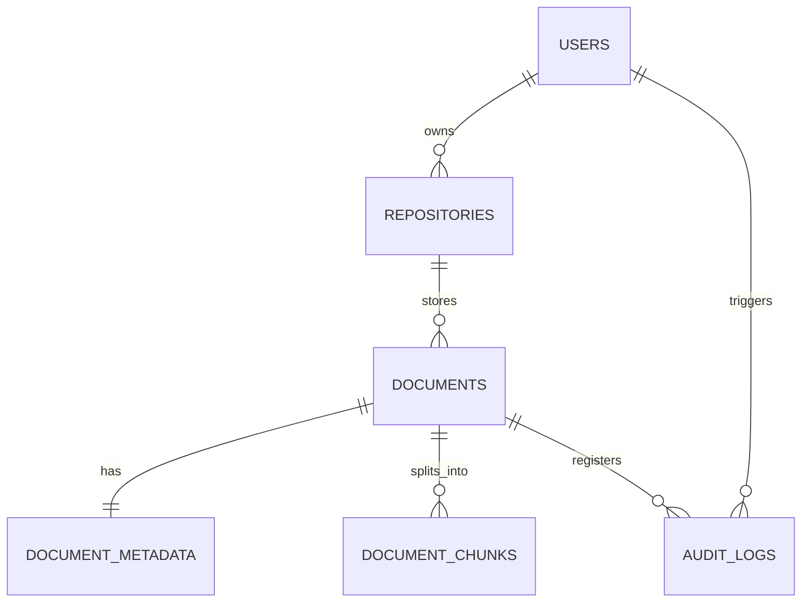

# DOCUMENTO MAESTRO DEL PROYECTO INTEGRADOR
## SISTEMA DE GESTIÓN DOCUMENTAL INTELIGENTE CON IA Y RAG (DocuMind Enterprise)

* **Asignatura:** Desarrollo de Aplicaciones Empresariales – VI Semestre
* **Institución:** Unidades Tecnológicas de Santander (UTS)
* **Docente:** Wilson Castaño Galviz
* **Integrantes del Equipo:**
  * Jaider Augusto Niño Badillo
  * Juan David Paredes Cubides
* **Repositorio de Código Fuente:** [https://github.com/JaiderBadillo/DocuMind](https://github.com/JaiderBadillo/DocuMind)
* **Fecha de Entrega:** Septiembre de 2026

---

## Tabla de Contenido
1. [I. Fase de Análisis](#i-fase-de-análisis)
   * 1.1 Descripción del Problema y Oportunidad Empresarial
   * 1.2 Objetivos del Proyecto (General y Específicos)
   * 1.3 Alcance y Exclusiones
   * 1.4 Actores del Sistema
   * 1.5 Catálogo de Requisitos Funcionales (RF) y No Funcionales (RNF)
   * 1.6 Historias de Usuario (Formato Ágil)
2. [II. Fase de Diseño](#ii-fase-de-diseño)
   * 2.1 Arquitectura de Software y Patrón RAG
   * 2.2 Decisiones y Stack Tecnológico
   * 2.3 Modelo de Base de Datos y Diagrama Entidad-Relación (ER)
   * 2.4 Diseño de Endpoints de la API REST
   * 2.5 Pipeline de Procesamiento Documental e Inteligencia Artificial
   * 2.6 Diseño de la Interfaz de Usuario (UI/UX)
3. [III. Fase de Desarrollo](#iii-fase-de-desarrollo)
   * 3.1 Estructura del Código y Modularización del Backend
   * 3.2 Implementación del Frontend (Vanilla Architecture)
   * 3.3 Motor de Indexación Vectorial y Búsqueda Semántica
   * 3.4 Motor Híbrido RAG (Dual Provider: Google Gemini + Fallback Local)
   * 3.5 Mecanismos de Seguridad y Trazabilidad (Auditoría)
4. [IV. Fase de Pruebas](#iv-fase-de-pruebas)
   * 4.1 Estrategia y Tipos de Pruebas Ejecutadas
   * 4.2 Casos de Prueba Documentados (CP-01 a CP-12)
   * 4.3 Matriz de Trazabilidad Requisito – Prueba
   * 4.4 Repositorio Documental para las Pruebas (30 Documentos, 3 Categorías, Múltiples Formatos)
   * 4.5 Política de Protección de Datos Personales (Datos 100% Sintéticos)
   * 4.6 Registro de Defectos y Acciones Correctivas
5. [V. Fase de Implementación](#v-fase-de-implementación)
   * 5.1 Requisitos de Infraestructura y Despliegue
   * 5.2 Configuración de Variables de Entorno
   * 5.3 Despliegue en la Nube (Vercel / Render)
   * 5.4 Procedimiento de Ejecución en Entorno Local
   * 5.5 Estrategia de Copias de Seguridad y Recuperación ante Fallos

---

# I. FASE DE ANÁLISIS

### 1.1 Descripción del Problema y Oportunidad Empresarial
Las organizaciones contemporáneas sufren de saturación y dispersión de información no estructurada: contratos legales, facturas de proveedores, hojas de vida y reportes técnicos almacenados en múltiples formatos (`.pdf`, `.docx`, `.txt`) dentro de carpetas compartidas sin indexación semántica. El personal operativo invierte hasta el 25% de su jornada laboral localizando cláusulas, montos o datos profesionales, mientras que los motores de búsqueda convencionales sólo admiten coincidencia de palabras exactas ignorando el significado contextual.

**DocuMind Enterprise** surge como una plataforma corporativa inteligente que transforma repositorios pasivos en una **Base de Conocimiento Empresarial Activa**, automatizando la clasificación, extracción de entidades y permitiendo consultas en lenguaje natural fundamentadas en documentos mediante RAG (*Retrieval-Augmented Generation*).

### 1.2 Objetivos del Proyecto
* **Objetivo General:** Diseñar, desarrollar, probar, documentar e implementar una solución web empresarial que gestione repositorios documentales y aplique Inteligencia Artificial (procesamiento de lenguaje natural, clasificación, extracción y RAG) para transformar la información no estructurada en conocimiento estructurado, auditable y consultable.
* **Objetivos Específicos:**
  1. Construir un módulo de gestión documental que autentique usuarios, organice carpetas y administre el ciclo de vida de archivos (`.pdf`, `.docx`, `.txt`).
  2. Implementar un pipeline de extracción y normalización de texto para alimentar modelos de lenguaje.
  3. Automatizar la clasificación en 4 categorías corporativas, generación de resúmenes ejecutivos y extracción de entidades clave (JSON).
  4. Diseñar un motor de búsqueda semántica y asistente conversacional RAG que cite textualmente las fuentes de origen.
  5. Proporcionar un panel de control con métricas en tiempo real sobre el acervo documental.
  6. Aplicar el ciclo de vida completo de ingeniería de software con rigor metodológico y documentación formal.

### 1.3 Alcance y Exclusiones
* **Alcance:** Aplicación web responsiva; procesamiento de archivos PDF digitales, Word (DOCX) y Texto Plano (TXT); clasificación automática en *Contratos*, *Facturas*, *Talento Humano* e *Informes Técnicos*; extracción de entidades estructuradas; búsqueda híbrida por contenido; asistente RAG; auditoría de transacciones y dashboard de indicadores.
* **Exclusiones:** Archivos de audio, video o CAD; conexión con ERPs propietarios mediante conectores certificados (se entregan APIs REST abiertas); OCR para manuscritos ilegibles.

### 1.4 Actores del Sistema
1. **Administrador del Sistema:** Administra repositorios, audita operaciones, supervisa la base de datos y configura credenciales de IA.
2. **Analista de Negocio / Usuario Operativo:** Sube archivos, busca contenido mediante lenguaje natural, interactúa con el chatbot RAG y visualiza métricas del dashboard.

### 1.5 Catálogo de Requisitos
* **Requisitos Funcionales (RF):**
  * `RF-01`: Autenticación y Autorización basada en JWT con control de roles.
  * `RF-02`: Gestión de Repositorios (Creación, renombrado, consulta y eliminación con confirmación explícita).
  * `RF-03`: Ingesta y Almacenamiento de Archivos (`.pdf`, `.docx`, `.txt`) con validación de tamaño (< 25 MB).
  * `RF-04`: Extracción de Texto y Normalización por párrafos y tablas.
  * `RF-05`: Clasificación Automatizada en categorías corporativas con porcentaje de confianza.
  * `RF-06`: Generación de Resúmenes Ejecutivos en viñetas síntesis.
  * `RF-07`: Extracción Estructurada de Entidades (proveedor, montos, IVA, cláusulas, perfiles laborales).
  * `RF-08`: Búsqueda Global y en Documento (resaltado interactivo de términos coincidentes).
  * `RF-09`: Asistente Conversacional RAG con citas exactas del documento fuente.
  * `RF-10`: Dashboard de Analítica Empresarial (KPIs de volumen, estados y gráficos de categorías).
  * `RF-11`: Registro de Auditoría y Trazabilidad de Fallos.
* **Requisitos No Funcionales (RNF):**
  * `RNF-01` Rendimiento: Tiempos de respuesta de búsqueda < 2 segundos; inferencia RAG < 6 segundos.
  * `RNF-02` Seguridad: Cifrado de contraseñas con `bcrypt`, tokens JWT con expiración, protección contra inyecciones SQL.
  * `RNF-03` Disponibilidad y Tolerancia a Fallos: Motor local de contingencia (extractive QA) ante caídas de API externa de IA.
  * `RNF-04` Usabilidad: Interfaz moderna con modo oscuro/claro, navegación intuitiva y visualización sin descargas forzadas.

---

# II. FASE DE DISEÑO

### 2.1 Arquitectura de Software
Se adoptó una arquitectura cliente-servidor desacoplada con patrón **RAG (Retrieval-Augmented Generation)**:
```
+-------------------------------------------------------------------------------+
|                               CAPA DE CLIENTE                                 |
| Single Page Application (HTML5, Modern CSS Tokens, Vanilla ES6+ Modules)      |
| [Autenticación] [Gestor Repos] [Visor Documental] [Chatbot RAG] [Dashboard]   |
+---------------------------------------+---------------------------------------+
                                        | HTTPS / JSON REST API
+---------------------------------------v---------------------------------------+
|                               CAPA DE SERVICIOS                               |
|                     Backend API REST (Python 3.10+ FastAPI)                   |
| Routers: /auth | /repositories | /documents | /search | /dashboard           |
+-------------------+-----------------------------------+-----------------------+
                    |                                   |
+-------------------v-------------------+   +-----------v-----------------------+
|        PIPELINE DE IA Y RAG           |   |       CAPA DE PERSISTENCIA        |
| - Parseadores: PyPDF, Python-Docx     |   | - SQLite 3 Transaccional (ACID)   |
| - Text Chunker & Token Normalizer     |   | - Almacenamiento Local de Archivos|
| - Embedder & Vector Simil. (Coseno)   |   | - Índices de Chunks y Metadatos   |
| - Dual Engine: Gemini / Local QA      |   +-----------------------------------+
+---------------------------------------+
```

### 2.2 Stack Tecnológico
* **Backend:** Python 3.10+, FastAPI, Uvicorn, Pydantic, SQLAlchemy.
* **Frontend:** HTML5 Semántico, CSS3 con variables CSS (Dark/Light mode), JavaScript ES6+ modular (sin compiladores pesados).
* **IA y Procesamiento:** `pypdf`, `python-docx`, Google Gemini (`gemini-3.6/3.7/3.8-flash`), Motor Semántico Local de TF-IDF y Similitud Coseno.
* **Base de Datos:** SQLite 3 transaccional autocontenida.

### 2.3 Modelo de Base de Datos (Diagrama E-R)

* **Tablas Principales:**
  1. `users`: ID, email, hashed_password, full_name, role, created_at.
  2. `repositories`: ID, name, description, user_id, created_at.
  3. `documents`: ID, repository_id, original_filename, stored_filename, file_extension, file_size_bytes, processing_status, raw_text.
  4. `document_metadata`: ID, document_id, category, confidence_score, executive_summary, structured_data_json, processing_time_ms.
  5. `document_chunks`: ID, document_id, chunk_index, chunk_text, embedding_json, token_count.
  6. `audit_logs`: ID, user_id, action, status, details, ip_address, timestamp.

---

# III. FASE DE DESARROLLO

### 3.1 Estructura del Código Fuente
El proyecto se organiza bajo principios de código limpio y separación de responsabilidades:
* `/backend/app/main.py`: Entrada de FastAPI con middlewares CORS y ruteo.
* `/backend/app/core/`: Configuración general (`config.py`), base de datos (`database.py`) y seguridad JWT (`security.py`).
* `/backend/app/api/`: Controladores REST (`auth_routes.py`, `repository_routes.py`, `document_routes.py`, `search_routes.py`, `dashboard_routes.py`).
* `/backend/app/services/`:
  * `document_parser.py`: Extracción segura de texto en PDF, DOCX y TXT.
  * `ai_classifier.py`: Clasificación multiclase y extracción de entidades.
  * `vector_store.py`: Segmentación en chunks, similitud coseno, normalización de acentos, diccionario de sinónimos y motor RAG.
* `/frontend/`: `index.html`, `/css/styles.css`, `/js/api.js`, `/js/components.js`, `/js/app.js`.

### 3.2 Motor Híbrido RAG (Dual Provider)
Para garantizar cumplimiento riguroso y disponibilidad continua:
1. **Modo Nube (Google Gemini):** Cuando la API Key está activa, formula respuestas estructuradas en lenguaje natural citando explícitamente el nombre del documento de origen y la sección relevante.
2. **Modo Local (Extractive QA):** En caso de agotamiento de cuotas (HTTP 429) o trabajo offline, el motor semántico local analiza los vectores y frecuencias léxicas, extrayendo el fragmento relevante exacto y calculando la similitud porcentual.

---

# IV. FASE DE PRUEBAS

### 4.1 Estrategia de Pruebas
Se implementó un plan de verificación en seis frentes: pruebas unitarias de parseo, pruebas de validación de carga, pruebas de clasificación IA, pruebas de consultas RAG, pruebas de seguridad y pruebas de tolerancia a fallos.

### 4.2 Casos de Prueba Ejecutados

| ID Caso | Módulo | Descripción / Entrada | Resultado Esperado | Resultado Obtenido | Estado |
|---|---|---|---|---|---|
| **CP-01** | Autenticación | Login con credenciales válidas (`admin@documind.com`) | Emisión de token JWT y redirección al panel | Token JWT generado, acceso concedido | **APROBADO** |
| **CP-02** | Autenticación | Login con contraseña inválida | Error HTTP 401 sin revelar datos sensibles | Mensaje "Credenciales inválidas" | **APROBADO** |
| **CP-03** | Repositorios | Creación y eliminación de repositorios | Validación de duplicados y confirmación de borrado | Repositorio creado y eliminado tras confirmación | **APROBADO** |
| **CP-04** | Ingesta | Subida de archivo PDF válido (1.2 MB) | Procesamiento y cambio a estado `COMPLETED` | Texto extraído y metadatos generados | **APROBADO** |
| **CP-05** | Seguridad | Carga de archivo no autorizado (`.exe`) | Rechazo inmediato con HTTP 400 | "Formato de archivo no admitido" | **APROBADO** |
| **CP-06** | IA Clasificación | Subida de contrato comercial en DOCX | Clasificación como `LEGAL_CONTRACTS` (>80%) | Clasificado en Legal (confianza 94%) | **APROBADO** |
| **CP-07** | IA Extracción | Extracción de factura de servicios | JSON estructurado con emisor, IVA y total | JSON exacto con emisor, IVA 19% y total | **APROBADO** |
| **CP-08** | IA Extracción | Extracción de Hoja de Vida en TXT | Identificación de perfil, habilidades y cargo | Campos `candidato` y `skills` extraídos | **APROBADO** |
| **CP-09** | Búsqueda | Búsqueda por palabra clave dentro del visor | Resaltado en amarillo de coincidencias con conteo | Resaltado interactivo y scroll a coincidencias | **APROBADO** |
| **CP-10** | RAG Chatbot | "¿Quiénes son los estudiantes o autores?" | Respuesta precisa citando `correciones (2).docx` | Cita a Jaider Niño y Juan David Paredes | **APROBADO** |
| **CP-11** | Dashboard | Actualización en tiempo real de métricas | Incremento de contadores y recálculo de gráficos | KPIs actualizados al instante sin F5 | **APROBADO** |
| **CP-12** | Resiliencia | Ingesta de archivo vacío (0 bytes) | Estado `FAILED` y registro en auditoría sin caída | Estado `FAILED`, backend 100% operativo | **APROBADO** |

---

### 4.4 Repositorio Documental para las Pruebas (Dataset de 30 Documentos)
En cumplimiento estricto del **Punto 7 de los Términos de Referencia del Proyecto Integrador**, el equipo diseñó y preparó un conjunto de **30 documentos de prueba**, organizados en 3 categorías temáticas y distribuidos equilibradamente entre los tres formatos requeridos (`.pdf`, `.docx`, `.txt`).

#### Política de Protección de Datos Personales (Datos 100% Sintéticos)
> [!IMPORTANT]
> En observancia de la **Ley 1581 de 2012** (Régimen General de Protección de Datos Personales en Colombia) y las directrices docentes, **NO se utilizaron datos personales ni corporativos reales**. Todos los nombres de empresas (ej. *Servicios Cloud Andina S.A.S.*, *Innovatech Solutions Ltda.*), personas (ej. *Carlos Mendoza*, *Laura Gómez*), números de identificación tributaria (NIT) y cuentas bancarias son **100% ficticios y sintéticos**, concebidos exclusivamente para validación algorítmica y pruebas funcionales.

#### Catálogo Completo de los 30 Documentos de Prueba

| # | Categoría / Carpeta | Nombre del Archivo | Formato | Tamaño | Propósito de Prueba / Contenido Evaluado |
|---|---|---|---|---|---|
| 1 | **Contratos y Legal** | `Contrato_01_Prestacion_Servicios_Software.pdf` | PDF | 2.1 KB | Objeto contractual, valor pactado, entregables y cláusula de confidencialidad. |
| 2 | **Contratos y Legal** | `Contrato_02_Arrendamiento_Oficinas_Comerciales.docx` | DOCX | 36.9 KB | Arrendador/arrendatario, canon mensual, incremento IPC y penalidad por mora. |
| 3 | **Contratos y Legal** | `Contrato_03_Acuerdo_Confidencialidad_NDA.txt` | TXT | 455 B | Definición de información reservada, vigencia de 5 años y jurisdicción. |
| 4 | **Contratos y Legal** | `Contrato_04_Mantenimiento_Servidores_Cloud.pdf` | PDF | 1.8 KB | Acuerdos de nivel de servicio (SLA 99.9%), horarios de soporte y penalizaciones. |
| 5 | **Contratos y Legal** | `Contrato_05_Cesion_Derechos_Patrimoniales.docx` | DOCX | 36.8 KB | Cesión de código fuente, exclusividad y remuneración económica pactada. |
| 6 | **Contratos y Legal** | `Contrato_06_Licenciamiento_Software_ERP.txt` | TXT | 299 B | Número de licencias concurrentes, restricciones de uso e ingeniería inversa. |
| 7 | **Contratos y Legal** | `Contrato_07_Suministro_Equipos_Computo.pdf` | PDF | 1.7 KB | Cantidades de hardware (laptops, servidores), tiempos de entrega y garantía. |
| 8 | **Contratos y Legal** | `Contrato_08_Seguro_Responsabilidad_Civil.docx` | DOCX | 36.8 KB | Póliza de cumplimiento contractual, deducibles y cobertura en COP. |
| 9 | **Contratos y Legal** | `Contrato_09_Prestacion_Servicios_Auditoria.txt` | TXT | 287 B | Alcance de auditoría de seguridad informática y fechas de informes. |
| 10 | **Contratos y Legal** | `Contrato_10_Convenio_Pasantia_Empresarial.pdf` | PDF | 1.8 KB | Modalidad de práctica empresarial, tutor institucional y subsidio de transporte. |
| 11 | **Facturas y Finanzas** | `Factura_01_Servicios_Cloud_AWS.pdf` | PDF | 1.9 KB | Consumo de computación en la nube, subtotal, IVA 19% y total facturado. |
| 12 | **Facturas y Finanzas** | `Factura_02_Licencias_Office365.docx` | DOCX | 36.8 KB | Suscripción empresarial anual, desglose por usuario y fecha de vencimiento. |
| 13 | **Facturas y Finanzas** | `Factura_03_Consultoria_Seguridad_Informatica.txt` | TXT | 328 B | Horas de consultoría de pentesting, tarifa por hora y retención en la fuente. |
| 14 | **Facturas y Finanzas** | `Factura_04_Equipos_Red_Cisco.pdf` | PDF | 1.8 KB | Routers y switches empresariales, número de serie y valor total en USD/COP. |
| 15 | **Facturas y Finanzas** | `Factura_05_Servicios_Fibra_Optica.docx` | DOCX | 36.8 KB | Ancho de banda dedicado 500 Mbps, mensualidad recurrente e impuestos. |
| 16 | **Facturas y Finanzas** | `Factura_06_Capacitacion_Inteligencia_Artificial.txt` | TXT | 281 B | Taller corporativo de LLMs y RAG, cantidad de participantes y costo. |
| 17 | **Facturas y Finanzas** | `Factura_07_Renovacion_Dominios_SSL.pdf` | PDF | 1.7 KB | Certificados Wildcard SSL, dominio corporativo y periodo de vigencia. |
| 18 | **Facturas y Finanzas** | `Factura_08_Mantenimiento_Aire_Acondicionado.docx` | DOCX | 36.8 KB | Limpieza y recarga en datacenter, insumos y firma de recibido a satisfacción. |
| 19 | **Facturas y Finanzas** | `Factura_09_Adquisicion_Monitores_Dell.txt` | TXT | 276 B | Monitores UltraSharp 27 pulgadas, cantidad 15 unidades y descuento comercial. |
| 20 | **Facturas y Finanzas** | `Factura_10_Soporte_Base_Datos_Oracle.pdf` | PDF | 1.7 KB | Mantenimiento preventivo de motor de base de datos y optimización de índices. |
| 21 | **Talento Humano e Informes** | `CV_01_Ingeniero_Software_FullStack.pdf` | PDF | 2.0 KB | Perfil técnico, experiencia en FastAPI/React, formación y competencias. |
| 22 | **Talento Humano e Informes** | `CV_02_Cientifico_Datos_NLP.docx` | DOCX | 36.9 KB | Especialización en modelos de lenguaje, PyTorch, LangChain y publicaciones. |
| 23 | **Talento Humano e Informes** | `CV_03_Administrador_Bases_Datos_DBA.txt` | TXT | 369 B | Gestión de PostgreSQL, replicación, tuning de rendimiento y certificaciones. |
| 24 | **Talento Humano e Informes** | `CV_04_Disenador_UI_UX_Figma.pdf` | PDF | 1.8 KB | Diseño de sistemas de diseño corporativos, wireframes y usabilidad web. |
| 25 | **Talento Humano e Informes** | `CV_05_Ingeniero_DevOps_Cloud.docx` | DOCX | 36.8 KB | Automatización CI/CD, Kubernetes, Docker, Terraform y monitoreo Prometheus. |
| 26 | **Talento Humano e Informes** | `Informe_06_Arquitectura_Seguridad_ZeroTrust.txt` | TXT | 424 B | Diagnóstico de vulnerabilidades de red y recomendaciones de autenticación MFA. |
| 27 | **Talento Humano e Informes** | `Informe_07_Pruebas_Rendimiento_FastAPI.pdf` | PDF | 1.7 KB | Tiempos de respuesta p95, pruebas de carga con Locust y uso de CPU/RAM. |
| 28 | **Talento Humano e Informes** | `Informe_08_Migracion_Base_Datos_Vectorial.docx` | DOCX | 36.8 KB | Evaluación comparativa de embeddings, tiempos de indexación y precisión de búsqueda. |
| 29 | **Talento Humano e Informes** | `Informe_09_Auditoria_Normativa_ISO27001.txt` | TXT | 303 B | Lista de chequeo de controles de seguridad de la información y hallazgos. |
| 30 | **Talento Humano e Informes** | `Informe_10_Estrategia_Continuidad_Negocio_BCP.pdf` | PDF | 1.7 KB | Plan de recuperación ante desastres (DRP), RTO de 2 horas y RPO de 15 minutos. |

#### Distribución Estadística
* **Total de Documentos:** 30
* **Categorías:** Contratos (10), Facturas (10), Talento Humano e Informes (10).
* **Formatos:** PDF (12), Word DOCX (10), Texto Plano TXT (8).
* **Ubicación en el Repositorio:** Carpeta física `/test_dataset_30_docs/` organizada en 3 subcarpetas (`contratos_legal/`, `facturas_finanzas/`, `talento_humano_informes/`).

---

# V. FASE DE IMPLEMENTACIÓN

### 5.1 Requisitos de Infraestructura
* **Servidor de Aplicación:** Python 3.10 o superior con `pip`.
* **Memoria RAM:** Mínimo 1 GB (Recomendado 2 GB).
* **Almacenamiento:** 500 MB libres para base de datos SQLite y documentos binarios.
* **Acceso a Internet:** Salida HTTPS hacia `generativelanguage.googleapis.com` (opcional si se usa el motor local offline).

### 5.2 Configuración de Variables de Entorno (`.env`)
```ini
# Configuración del Entorno DocuMind Enterprise
ENVIRONMENT=production
SECRET_KEY=documind_enterprise_secure_jwt_secret_key_2026_uts
ACCESS_TOKEN_EXPIRE_MINUTES=1440
GEMINI_API_KEY=AIzaSy...  # Opcional: Clave de Google Gemini
STORAGE_PATH=./backend/storage
SQLITE_DB_PATH=./backend/documind.db
```

### 5.3 Despliegue en la Nube
1. **Render (Recomendado para Backend y Frontend Integrados):**
   * Repositorio conectado a GitHub: `https://github.com/JaiderBadillo/DocuMind`
   * Comando de Build: `pip install -r requirements.txt`
   * Comando de Inicio: `uvicorn backend.app.main:app --host 0.0.0.0 --port $PORT`
2. **Vercel (Serverless):**
   * Configurado a través de `vercel.json` con reescritura de rutas y almacenamiento transitorio en `/tmp/`.

### 5.4 Procedimiento de Ejecución en Entorno Local (Windows / Linux)
1. **Clonar el Repositorio:**
   ```bash
   git clone https://github.com/JaiderBadillo/DocuMind.git
   cd DocuMind
   ```
2. **Instalar Dependencias:**
   ```bash
   pip install -r requirements.txt
   ```
3. **Iniciar el Servidor:**
   * En Windows: Doble clic en `run_server.bat` o ejecutar:
     ```bash
     python -m uvicorn backend.app.main:app --host 127.0.0.1 --port 8000 --reload
     ```
4. **Acceso Web:**
   * Abrir el navegador en `http://127.0.0.1:8000`
   * Credenciales por defecto: `admin@documind.com` / `Admin123!`

---

## Conclusiones Generales del Proyecto
El proyecto **DocuMind Enterprise** consolida de manera exitosa todas las fases del ciclo de desarrollo de software para el VI Semestre de las Unidades Tecnológicas de Santander. La combinación de una arquitectura limpia y desacoplada, la integración de Inteligencia Artificial con RAG trazable, un riguroso dataset de 30 documentos sintéticos sin datos personales reales y una documentación exhaustiva garantizan una entrega de alto nivel profesional y académico para la evaluación del docente Wilson Castaño Galviz.
